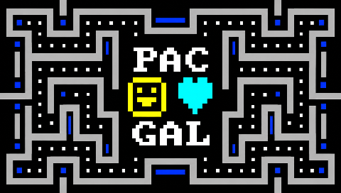

# PAC-GAL 1982 — ricostruzione in C / C recreation

**Italiano** | [English](#english)

Prova del 5 ottobre 2026: mappa e musica usano una nuova rappresentazione,
con confronti prima/dopo identici. Dettagli e limiti nel
[rapporto di riscrittura](docs/riscrittura-rappresentazione.md).

## Italiano

PAC-GAL è un gioco DOS di inseguimento in un labirinto attribuito ad Al J. Jiménez e datato maggio 1982. Il giocatore raccoglie i puntini, evita quattro avversari e usa i punti speciali per poterli mangiare temporaneamente. Il progetto realizza una ricostruzione nativa in C; per lo studio del gioco storico erano disponibili l'archivio ZIP e l'eseguibile DOS, senza il relativo sorgente.

### Da dove siamo partiti e cosa abbiamo fatto

L'analisi ha usato disassemblaggio e prove controllate in DOSBox per documentare mappe, schermate, movimenti, tempi e suoni. Il sorgente C implementa questi comportamenti in moduli collegati a SDL2. Il gioco funziona autonomamente, senza caricare o eseguire l'EXE storico; il font è incorporato e l'audio viene sintetizzato. La descrizione della mappa e le partiture conservano i contenuti ricostruiti durante l'analisi.

La ricostruzione comprende la mappa originale, i caratteri e colori CGA, il tunnel, le vite, i quattro avversari, i punti speciali, le collisioni, le animazioni, la schermata iniziale, la vittoria e il replay. Sono stati ricreati anche il generatore casuale BASIC e il ritmo degli effetti `PLAY`/`SOUND`; l'audio viene sintetizzato usando il divisore PIT del PC speaker. Confronti differenziali e test automatici verificano schermate, stato di gioco, tempi ed effetti sonori rispetto ai dati raccolti dall'originale.

Il DOS originale aveva un singolo labirinto: dopo averlo completato proponeva di rigiocare la stessa mappa. La modalità **Normale** conserva questo comportamento. La modalità **Remix**, aggiunta in questa riscrittura, genera invece labirinti progressivi senza fine: i corridoi sono collegati, il percorso resta dentro un perimetro rettangolare e le due uscite laterali cambiano posizione e riportano sempre nello stesso labirinto. I test del generatore controllano la raggiungibilità dei pallini e le uscite per giocatore e avversari su numerosi livelli e semi.

Il timing non dipende dalla velocità della CPU o dal refresh dello schermo. La fedeltà è stata misurata rispetto all'eseguibile e alle catture DOSBox disponibili; font, monitor, altoparlanti e differenze tra hardware possono comunque cambiare l'aspetto o il timbro. La sintesi dello speaker è un modello del PC speaker, non una registrazione o una misura di uno specifico altoparlante del 1982.

### Versioni e controlli

- **PC/Linux:** eseguibile SDL2, modalità Normale e Remix, ridimensionamento e schermo intero. Frecce o WASD muovono; Spazio/P mette in pausa; `+`/`-` regolano il ritmo; Esc apre la conferma d'uscita.
- **PS Vita:** VPK autonomo, display adattato allo schermo e controlli Vita. Select apre la richiesta d'uscita; X conferma e Cerchio annulla. I testi seguono la lingua della console.
- **PSP/Adrenaline:** `EBOOT.PBP` con icona e immagine di anteprima per il menu PSP. Usa lo schermo 480×272; frecce per muovere, X per confermare, Cerchio per annullare, Start per pausa e Select per la richiesta d'uscita. Italiano e spagnolo seguono la lingua di sistema; le altre lingue usano l'inglese.
- **DOS/DOSBox:** eseguibile DJGPP a 32 bit, compilato dal port C con backend SDL3 per DOS. Richiede un host DPMI installato separatamente e DOSBox con VGA/VESA e Sound Blaster; la release distribuisce il gioco, non un host DPMI.

Anteprima PSP / PSP menu preview:



I pacchetti compilati si trovano in `dist/` e nella [release GitHub](https://github.com/figarocool/Pac-Gal-Dos-PC-game-produced-by-J.-Jimenez-in-1982/releases). La release contiene il port DOSBox della riscrittura C, non l'eseguibile originale del 1982, che resta soggetto ai diritti del suo autore come specificato in [NOTICE](NOTICE). Gli strumenti che ripetono le prove DOS richiedono una copia locale dell'eseguibile nel percorso indicato da `tools/dos_oracle.py`.

### Compilare e provare

Su Linux servono un compilatore C, GNU Make, `pkg-config` e SDL2:

```sh
make
make test
./avvia.sh
```

`make test` esegue i test di regole, labirinto, timing, audio e avvio SDL senza display. `make differential` confronta il gioco con le catture DOS; `make deep-test` verifica introduzione, costruzione della mappa e scenari di gioco. `make oracle` e `python3 tools/audio_oracle.py` interrogano l'eseguibile storico e richiedono DOSBox.

Con VitaSDK e SDL2 in `/usr/local/vitasdk`, `make vita` compila e verifica il VPK. Con PSPSDK e SDL2 in `/usr/local/pspdev`, `make psp` genera `dist/PAC-GAL-PSP-EBOOT.PBP`. Su Vita, il VPK va installato con VitaShell. Per Adrenaline copia l'EBOOT in `ux0:/pspemu/PSP/GAME/PACGAL/EBOOT.PBP`.

Per DOSBox, segui [docs/build-dos.md](docs/build-dos.md): servono DJGPP e una build statica DOS di SDL3. Poi `make dos` genera `dist/PACGAL.EXE`.

La [guida al codice](docs/guida-al-codice.md) descrive moduli, coordinate, caratteri, colori e suoni. La [nota di reverse engineering](docs/reverse-engineering.md) documenta fonti, verifiche e limiti.

### Licenza e crediti

La riscrittura C e il font DOSBox sono distribuiti secondo GPL-2.0-or-later; vedere [LICENSE](LICENSE) e [NOTICE](NOTICE). Il gioco DOS originale non è incluso nella licenza della riscrittura. La modalità Remix riporta il credito a Stefano Basile.

---

<a id="english"></a>
## English

PAC-GAL is a DOS maze-chase game attributed to Al J. Jiménez and dated May 1982. The player collects dots, avoids four enemies, and uses special dots to eat them temporarily. This project provides a native C recreation; the historical ZIP archive and DOS executable were available for analysis, without the game's source code.

### Starting point and work completed

The analysis used disassembly and controlled DOSBox runs to document maps, screens, movement, timing, and sounds. The C source implements these behaviors in modules connected to SDL2. The game runs autonomously without loading or executing the historical EXE; the font is embedded and audio is synthesized. The map description and musical scores retain the content reconstructed during analysis.

The recreation includes the original maze, CGA characters and colors, tunnel, lives, four enemies, special dots, collisions, animations, title sequence, victory, and replay. We also recreated the BASIC random-number generator and the timing of `PLAY`/`SOUND` effects; audio is synthesized using the PC speaker's PIT divider. Differential comparisons and automated tests check screens, game state, timing, and sound effects against data captured from the original.

The DOS original had one maze: after completing it, the game offered to replay the same map. **Normal** mode preserves that behavior. **Remix**, added by this recreation, generates an endless progression of mazes: corridors are connected, paths stay within a rectangular perimeter, and two side exits move to new positions while always returning to the same maze. Generator tests check dot reachability and exits for the player and enemies across many levels and seeds.

Timing does not depend on CPU speed or display refresh. Fidelity was measured against the executable and available DOSBox captures; fonts, displays, speakers, and hardware differences can still affect appearance and tone. The speaker synthesis models a PC speaker; it is not a recording or measurement of a particular 1982 speaker.

### Builds and controls

- **PC/Linux:** SDL2 executable with Normal and Remix modes, window resizing, and fullscreen. Arrow keys or WASD move; Space/P pauses; `+`/`-` adjust the pace; Esc opens the exit prompt.
- **PS Vita:** standalone VPK, display fitted to the screen, and Vita controls. Select opens the exit prompt; X confirms and Circle cancels. Text follows the console language.
- **PSP/Adrenaline:** `EBOOT.PBP` with an icon and preview image for the PSP menu. It uses the 480×272 screen; D-pad moves, X confirms, Circle cancels, Start pauses, and Select opens the exit prompt. Italian and Spanish follow the system language; other languages use English.
- **DOS/DOSBox:** 32-bit DJGPP executable built from the C port with SDL3's DOS backend. It requires a separately installed DPMI host and DOSBox with VGA/VESA and Sound Blaster; the release includes the game, not a DPMI host.

Built packages are in `dist/` and the [GitHub release](https://github.com/figarocool/Pac-Gal-Dos-PC-game-produced-by-J.-Jimenez-in-1982/releases). The release contains the DOSBox port of the C recreation, not the original 1982 executable, which remains subject to its author's rights as described in [NOTICE](NOTICE). Tools that repeat DOS reference runs require a local copy of the executable at the path expected by `tools/dos_oracle.py`.

### Build and test

On Linux, install a C compiler, GNU Make, `pkg-config`, and SDL2:

```sh
make
make test
./avvia.sh
```

`make test` checks game rules, maze logic, timing, audio, and headless SDL startup. `make differential` compares the game against DOS captures; `make deep-test` checks the intro, maze construction, and gameplay scenarios. `make oracle` and `python3 tools/audio_oracle.py` query the historical executable and require DOSBox.

With VitaSDK and SDL2 installed in `/usr/local/vitasdk`, `make vita` builds and validates the VPK. With PSPSDK and SDL2 in `/usr/local/pspdev`, `make psp` creates `dist/PAC-GAL-PSP-EBOOT.PBP`. Install the VPK with VitaShell. For Adrenaline, copy the EBOOT to `ux0:/pspemu/PSP/GAME/PACGAL/EBOOT.PBP`.

For DOSBox, follow [docs/build-dos.md](docs/build-dos.md): DJGPP and a static DOS build of SDL3 are required. Then `make dos` creates `dist/PACGAL.EXE`.

The [code guide](docs/guida-al-codice.md) explains modules, coordinates, characters, colors, and sounds. The [reverse-engineering notes](docs/reverse-engineering.md) describe sources, checks, and limitations.

### License and credits

The C recreation and DOSBox font are distributed under GPL-2.0-or-later; see [LICENSE](LICENSE) and [NOTICE](NOTICE). The original DOS game is not covered by the recreation's license. Remix mode credits Stefano Basile.
